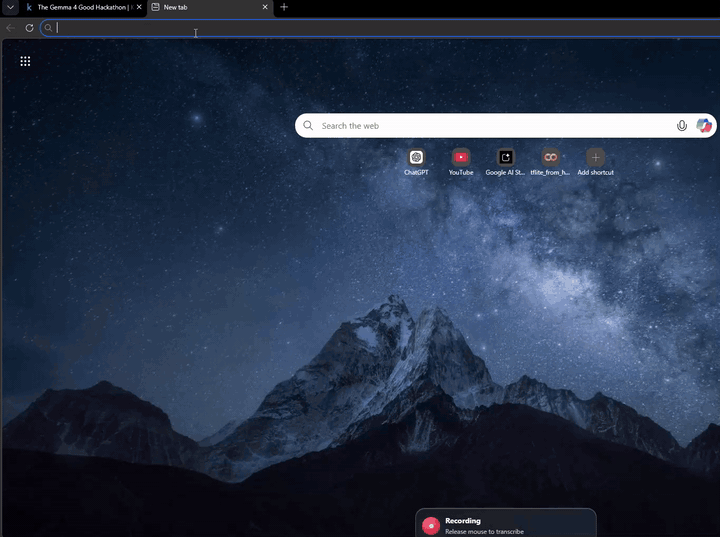
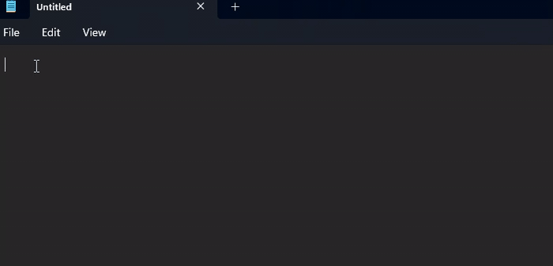
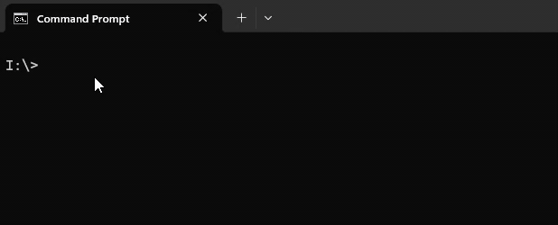
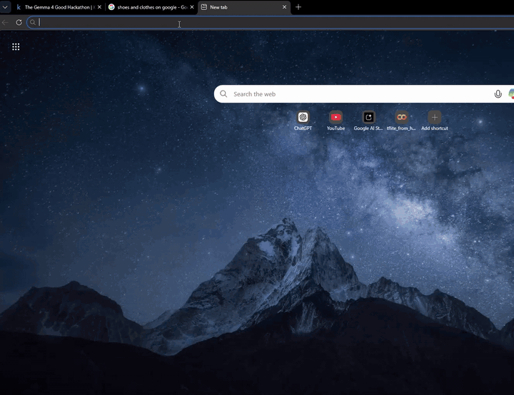

# Voice Keyboard

A Windows voice-to-keystroke application powered by a **local** multimodal LLM
(Gemma via [llama.cpp](https://github.com/ggerganov/llama.cpp)). Hold a mouse
button, speak, and the app transcribes, interprets and types the result —
including keyboard shortcuts — into the focused field of any application.

Everything runs on-device. No cloud calls. No audio leaves your machine.

[](LICENSE)


---

## Demo

### Speak into any focused field


### Shortcuts embedded in plain speech ("press enter", "control C")


### Address bar — spoken domains expand to URLs


### Context-aware dictation (cursor & selection)


---

## What makes this different

| | Voice Keyboard | Typical cloud dictation |
|---|---|---|
| Where audio goes | Stays on your machine | Uploaded to a vendor |
| Inference | Local GGUF model via llama.cpp | Remote API |
| Works offline | Yes | No |
| Keyboard shortcuts | First-class (`{{Enter}}`, `{{Ctrl+C}}`, …) | Usually no |
| Selected-text replace | Yes (UI Automation) | No |
| Cost per request | Free | Per-minute billing |

## Features

- **Push-to-talk gesture** — hold left mouse button, speak, release.
- **Local multimodal LLM** — Gemma E4B GGUF via a managed `llama-server.exe`.
- **Plain-text output with embedded shortcut tokens** like `{{Enter}}`, `{{Tab}}`, `{{Ctrl+C}}`, `{{Ctrl+Shift+T}}`. The parser converts these into real `SendInput` keystrokes.
- **Context-aware injection** — uses Windows UI Automation to read the focused field's text around the cursor / current selection, so dictated content reads correctly mid-word, mid-URL, or replaces a selection cleanly.
- **Address-bar smarts** — "gmail dot com" → `gmail.com{{Enter}}`, "open YouTube" → `https://www.youtube.com{{Enter}}`.
- **Spoken-email normalisation** — "jane the number four doe at gmail dot com" → `jane4doe@gmail.com`.
- **Diagnostics panel** — view the exact prompt, context, audio path, and screenshot the model received, plus the raw model output.
- **Built-in feedback / dataset capture** — flag correct or wrong examples from Diagnostics; the app writes JSONL plus paired WAVs for later fine-tuning.
- **Kill switch + dry run** — global enable/disable and a "don't actually type" preview mode.

## Quick start

### 1. Install

Download the latest installer from the
[Releases page](../../releases/latest) and run it.

The installer bundles the Tauri app and `llama-server.exe` runtime. **It does
not bundle GGUF model weights** — you'll grab those separately on first run.

### 2. Get a model

After installing, launch Voice Keyboard, open **Diagnostics → Open models
folder**, then drop a Gemma multimodal GGUF + matching `mmproj` file into it.
Or run the included downloader:

```powershell
powershell -ExecutionPolicy Bypass -File scripts\download-gemma4-models.ps1
```

Default model: `gemma-4-E4B-it.Q4_K_M.gguf` (~3 GB) plus its `mmproj-*.gguf`
projector.

### 3. Use it

1. Click into any text field in any app.
2. **Hold the left mouse button** until the indicator appears.
3. Speak.
4. **Release while holding the cursor still** — the app transcribes, interprets, and types.

## System requirements

- Windows 10 / 11 (x64).
- A microphone (and permission for desktop apps to use it).
- For acceptable latency: a Vulkan-capable GPU with ≥4 GB VRAM. Benchmarks on
  an RTX 4050 Laptop GPU with Q4_K_M gave ~60 ms TTFT and ~54 tokens/s
  (warm requests).

## Building from source

You need Node.js LTS, Rust stable, and Visual Studio Build Tools with the
"Desktop development with C++" workload.

```powershell
git clone https://github.com/<your-fork>/voicekeyboard.git
cd voicekeyboard
npm install
npm run tauri:dev          # dev build with hot reload
npm run tauri:build        # release installer (NSIS + MSI)
```

Installer output:

```
src-tauri\target\release\bundle\nsis\Voice Keyboard_<version>_x64-setup.exe
src-tauri\target\release\bundle\msi\Voice Keyboard_<version>_x64_en-US.msi
```

For VM / clean-machine testing, see [docs/installer-and-vm-testing.md](docs/installer-and-vm-testing.md).

## Architecture

```
┌──────────────────────────────────────────────────────────────────┐
│  Tauri frontend (TypeScript + Vite)         src/                 │
│    Diagnostics UI, settings, dataset capture                     │
└───────────────┬──────────────────────────────────────────────────┘
                │  Tauri IPC
┌───────────────▼──────────────────────────────────────────────────┐
│  Rust core                                  src-tauri/src/       │
│    gesture.rs   — global mouse-hold trigger (rdev)               │
│    audio.rs     — cpal capture, rolling buffer, pre-roll         │
│    context.rs   — active window, UIA focused text & selection    │
│    model.rs     — manages llama-server, prompts, streaming       │
│    parser.rs    — plain-text + {{shortcut}} → Action stream      │
│    injection.rs — Win32 SendInput text & shortcut delivery       │
│    safety.rs    — dry-run, large-text confirm, kill switch       │
└───────────────┬──────────────────────────────────────────────────┘
                │  HTTP 127.0.0.1:8099
┌───────────────▼──────────────────────────────────────────────────┐
│  llama-server.exe  (bundled, llama.cpp)                          │
│    Gemma E4B multimodal GGUF + mmproj                            │
└──────────────────────────────────────────────────────────────────┘
```

## Configuration

Settings are stored in
`%APPDATA%\VoiceKeyboard\VoiceKeyboard\config\settings.json` and are also
editable from the in-app Settings tab. Key options:

| Setting | Default | Purpose |
|---|---|---|
| `trigger_hold_ms` | 450 | How long the mouse button must be held to arm recording. |
| `movement_tolerance_px` | 12 | Cursor jitter allowed during the final 250 ms before release. |
| `right_click_trigger_enabled` | false | Optional right-mouse-button trigger (off by default to avoid context-menu conflicts). |
| `dry_run` | false | Process audio and show output, but do not actually type. |
| `confirm_large_text_chars` | 800 | Confirm before injecting unusually long output. |
| `kill_switch_enabled` | true | Global enable/disable from tray. |
| `common_terms` | "" | Free-text hints (your name, common emails/companies) added to every prompt. |

## Roadmap

- Optional keyboard hotkey trigger (for users who dislike mouse-hold).
- Better right-click context-menu handling.
- Linux + macOS ports (currently Windows-only because of UIA + SendInput).
- Smaller / faster models as the GGUF ecosystem improves.

## Contributing

Contributions are very welcome — bug reports, fixes, prompt-tuning ideas,
new shortcut tokens, additional language support. See
[CONTRIBUTING.md](CONTRIBUTING.md) for how to get started, the code layout, and
the test commands. By participating you agree to the
[Code of Conduct](CODE_OF_CONDUCT.md).

## License

This project is licensed under the
[PolyForm Noncommercial License 1.0.0](LICENSE).

In plain English:

- You may **view, modify, run, and share** Voice Keyboard for any
  **noncommercial** purpose — personal use, research, education, charity.
- You may **not** use it for commercial purposes (selling it, embedding it in a
  paid product, running it as a paid service).
- For commercial licensing, please open an issue to start a conversation.

PolyForm Noncommercial is a software-specific license modelled on the spirit of
Creative Commons BY-NC, but drafted by lawyers for code. See
[polyformproject.org](https://polyformproject.org/) for background.

## Acknowledgements

- [llama.cpp](https://github.com/ggerganov/llama.cpp) for the local inference runtime.
- [Tauri](https://tauri.app/) for the desktop shell.
- The Gemma model team at Google for the open weights.
